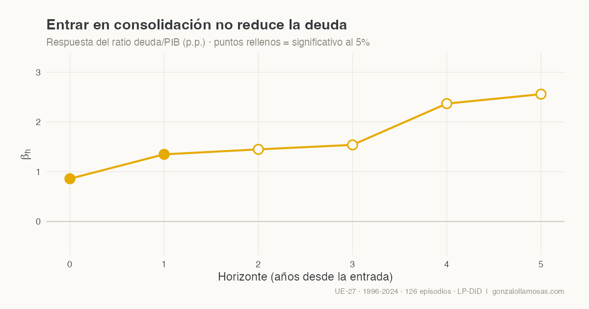

{.post-banner fig-alt="Respuesta del ratio deuda/PIB a la entrada en consolidación fiscal. Los puntos de los horizontes 0 y 1 son significativos al 5%."}

La intuición es sencilla. Si un país recorta su déficit, su deuda debería
crecer menos y el ratio deuda/PIB debería bajar. Esa intuición sostiene
buena parte del diseño de la política fiscal europea desde hace décadas.
En un [working paper reciente](https://www.researchgate.net/publication/403998208_Does_Fiscal_Consolidation_Reduce_Public_Debt_Evidence_from_the_European_Union_Using_Local_Projections),
con Cristina Mazas Pérez-Oleaga y José M. Domínguez Martínez, ponemos esa
intuición frente a los datos de la UE-27. El resultado incomoda: entrar en
consolidación fiscal no reduce el ratio de deuda y, a corto plazo, lo
aumenta.

## Qué hicimos

Estudiamos los 27 países de la UE entre 1996 y 2024. Definimos un episodio
de consolidación como el año en que el saldo primario estructural mejora al
menos un punto porcentual del PIB potencial, una definición estándar que
captura el esfuerzo fiscal discrecional y no el ciclo. Eso da 126 episodios
utilizables. Para estimar sus efectos usamos proyecciones locales con la
metodología de diferencias en diferencias de Dube y coautores (2025), que
evita un problema clásico de este tipo de estudios, el de comparar países
que consolidan con países que también están consolidando un poco más tarde
o un poco antes. Solo comparamos cada episodio con países limpios, que no
consolidan en la ventana relevante.

## Qué encontramos

En el año de entrada, el ratio deuda/PIB sube 0,86 puntos respecto a los
países comparables. Al año siguiente, 1,35 puntos. Ambos efectos son
estadísticamente significativos. En horizontes más largos las estimaciones
puntuales siguen creciendo, hasta unos 2,5 puntos a cinco años, aunque
pierden precisión, algo esperable con 27 países.

Lo interesante no es el titular sino el porqué. Descomponemos la dinámica
de la deuda y encontramos cuatro mecanismos que operan a la vez.

El primero es el producto. El PIB real cae de forma persistente tras la
entrada en consolidación, alrededor de un 1,6 por ciento en el impacto y
un 3 por ciento acumulado a tres años. Como el ratio de deuda tiene el PIB
en el denominador, parte del aumento es pura aritmética.

El segundo es la inversión pública, que cae de forma monótona durante todo
el horizonte. Es la partida más fácil de recortar políticamente y la que
más daño hace al crecimiento futuro.

El tercero son los ajustes stock-flujo, esa categoría residual que recoge
todo lo que mueve la deuda sin pasar por el déficit. Lejos de ser ruido,
encontramos que se mantienen elevados y significativos en todos los
horizontes tras una consolidación.

El cuarto es el que más cuestiona el relato convencional. Si los mercados
premiaran el esfuerzo fiscal, las primas de riesgo deberían bajar tras una
consolidación. No bajan. El diferencial soberano sube en el impacto y
después simplemente vuelve a su nivel. No hay dividendo de credibilidad.

Conviene subrayar que el esfuerzo fiscal es real. El saldo primario mejora
en torno a tres puntos de PIB y se mantiene. El problema no es que los
gobiernos no consoliden, es que la aritmética de la deuda se come el
esfuerzo por las otras tres vías.

## No todas las consolidaciones son iguales

El resultado medio esconde una asimetría importante. Cuando el diferencial
entre el tipo de interés y el crecimiento es desfavorable, consolidar
empeora claramente el ratio, 1,7 puntos en el impacto y 3,2 al año
siguiente. Cuando el diferencial es favorable, las estimaciones cambian de
signo, aunque son imprecisas. Dicho de otro modo, consolidar en el peor
momento macroeconómico es precisamente cuando más se autolesiona la
política.

El diseño también importa. Las consolidaciones que protegen la inversión
pública muestran mejores resultados de deuda que las que la recortan, y es
el rasgo de diseño más robusto que encontramos.

## Por qué importa ahora

El marco fiscal europeo reformado en 2024 introduce sendas de ajuste
específicas por país y un tratamiento especial para la inversión. Nuestros
resultados respaldan empíricamente ambas decisiones. Y operacionalizan
para la UE-27 el debate que abrió Blanchard sobre la deuda con tipos
bajos: en regímenes macroeconómicos adversos, la austeridad puede subir el
ratio de deuda que pretendía bajar.

El paper completo, con la estrategia empírica y todas las robusteces, está
disponible en [ResearchGate](https://www.researchgate.net/publication/403998208_Does_Fiscal_Consolidation_Reduce_Public_Debt_Evidence_from_the_European_Union_Using_Local_Projections)
y en la página de [Research](../../research.qmd).

## La figura de cabecera, en unas líneas de R

Una manía de la casa: las figuras de este blog se generan con código
reproducible. La de arriba son las estimaciones puntuales del paper, nada
más, y se dibuja así.

```r
library(ggplot2)

irf <- data.frame(
  h    = 0:5,
  beta = c(0.86, 1.35, 1.45, 1.54, 2.37, 2.56),
  sig  = c(TRUE, TRUE, FALSE, FALSE, FALSE, FALSE)
)

ggplot(irf, aes(h, beta)) +
  geom_hline(yintercept = 0, colour = "#c9c2b4") +
  geom_line(colour = "#E6AA04", linewidth = 1.4) +
  geom_point(aes(fill = sig), shape = 21, size = 5.5,
             colour = "#E6AA04", stroke = 1.6) +
  scale_fill_manual(values = c("#FBFAF7", "#E6AA04"), guide = "none") +
  labs(x = "Horizonte (años desde la entrada)", y = expression(beta[h])) +
  theme_minimal(base_size = 16)
```


