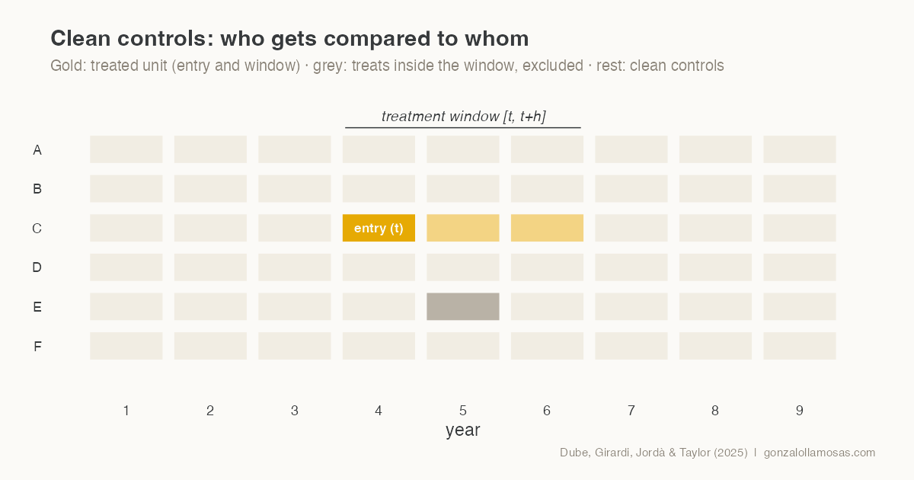

{.post-banner fig-alt="Schematic of the clean-control rule. The treated unit enters at year t with a window to t plus h; a unit that treats inside the window is excluded; the remaining rows are clean controls."}

Event studies on macro panels have a quiet problem. In a standard two-way
fixed effects setup, countries that treated earlier serve as controls for
countries that treat later, and vice versa. When treatment effects are
heterogeneous or dynamic, those comparisons contaminate the estimates, a
point the difference-in-differences literature has made forcefully over
the last few years. Fiscal policy applications are especially exposed,
because consolidation episodes cluster in time, think 2010 to 2013, and
their effects build slowly.

The Local Projections Difference-in-Differences estimator of Dube,
Girardi, Jordà and Taylor (2025, *Journal of Applied Econometrics*)
addresses this with two design choices that are easy to state and easy to
audit. In a [recent working paper](https://www.researchgate.net/publication/403998208_Does_Fiscal_Consolidation_Reduce_Public_Debt_Evidence_from_the_European_Union_Using_Local_Projections)
with Cristina Mazas Pérez-Oleaga and José M. Domínguez Martínez, we apply
it to 126 fiscal consolidation episodes in the EU-27. A few practical
lessons follow.

## The two design choices

First, treatment is defined as entry. The treatment indicator switches on
in the year a country crosses the consolidation threshold, an improvement
of at least one percentage point of potential GDP in the structural
primary balance, and what is estimated is the effect of entering an
episode, horizon by horizon.

Second, and this is the core of the method, the control group at each
horizon contains only clean observations, meaning countries that are not
treated anywhere in the window from the entry year to the horizon of
interest. No forbidden comparisons enter the estimate. The outcome is a
long difference from the pre-treatment year, and the specification adds
country fixed effects, year-by-horizon fixed effects, two lags of the
outcome change and lagged macro controls.

The cost is transparency about sample loss. Of 135 episodes in our panel,
126 survive the clean-control requirement at the impact horizon, and the
effective sample shrinks as the horizon lengthens. We report the counts at
every horizon, and we would encourage anyone using the method to do the
same, because the estimand quietly changes with the surviving sample.

## The estimator in a few lines of R

Stripped to its essentials, the whole procedure fits on one screen. For
each horizon, build the long difference, flag the units that stay
untreated through the window, keep entries and clean controls only, and
run the fixed-effects regression.

```r
library(dplyr)
library(fixest)

lpdid_h <- function(panel, h) {
  df <- panel |>
    group_by(country) |>
    mutate(
      d_y   = lead(debt_gdp, h) - lag(debt_gdp, 1),           # long difference
      clean = slider::slide_dbl(entry, max, .after = h) == 0  # untreated in [t, t+h]
    ) |>
    ungroup() |>
    filter(entry == 1 | clean)                                # no forbidden comparisons

  feols(d_y ~ entry + d_debt_l1 + d_debt_l2 + x_l1 | country + year,
        data = df, cluster = ~country)
}

irf <- lapply(0:5, function(h) lpdid_h(panel, h))

# 27 clusters: complement with a wild cluster bootstrap (Webb weights)
fwildclusterboot::boottest(irf[[1]], param = "entry",
                           B = 999, type = "webb")
```

Each element of `irf` is one point of the impulse response, and the
header figure of this post was drawn with the same logic. The real code
adds the placebo horizons, the trimming and the robustness battery, but
nothing conceptually new.

## What we learned applying it

Inference with 27 clusters deserves more care than the default. We cluster
at the country level and complement the usual standard errors with a wild
cluster bootstrap using six-point Webb weights, which behaves better with
few clusters. Conclusions that survive both are worth keeping; one of our
headline results, the short-run increase in the debt ratio, does.

Pre-trends are testable and worth showing in three flavours. We report
placebo coefficients at one, two and three years before entry for the
baseline specification, for a conditional parallel-trends version and for
a propensity-score trimmed sample restricted to common support. All three
come out flat, which is what gives the post-treatment estimates their
credibility.

Power, not bias, is the binding constraint at long horizons. Our point
estimates grow with the horizon while their precision falls, and the
honest reading is that the short-run effects are the reliable evidence.
Writing that sentence in the paper, rather than hoping a referee will not
notice, turned out to be the better strategy.

The full paper, including the debt decomposition that explains why
consolidations fail to reduce the ratio, is on
[ResearchGate](https://www.researchgate.net/publication/403998208_Does_Fiscal_Consolidation_Reduce_Public_Debt_Evidence_from_the_European_Union_Using_Local_Projections)
and summarised on the [Research](../../research.qmd) page.


