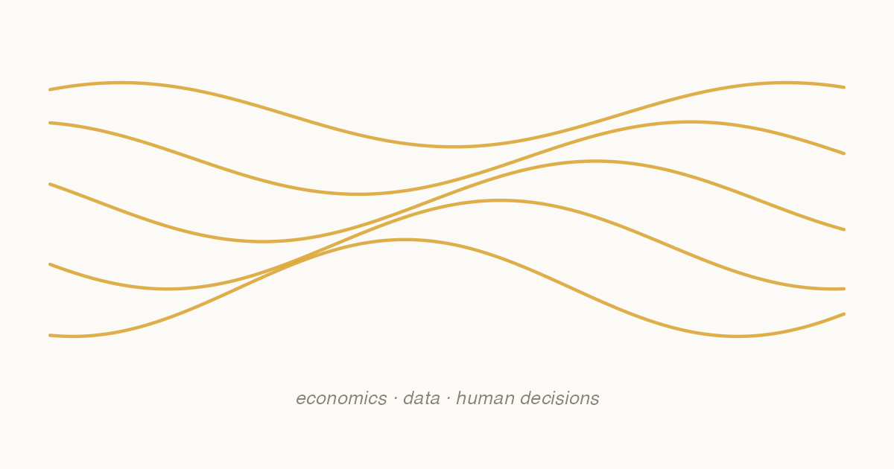

{.post-banner fig-alt="Gold wave motif with the tagline economics, data, human decisions."}

This is the first post of a blog that will accompany my research and the [Outlook Project](../../outlook-project.qmd) channel.

The plan is simple. Most posts will be short — between 800 and 1,500 words — and will fall into one of three buckets:

1. **Notes on fiscal policy and public debt.** Mostly things that come up while I work on papers but do not fit in the paper itself.
2. **Behavioural economics applied to public policy.** Often closer to the *Journal of Behavioral and Experimental Economics* line of work.
3. **AI and economic research.** How generative AI is changing both the research workflow and the questions worth asking, with practical examples in R and Python.

Posts will be in English or Spanish depending on the audience. Op-eds and pieces aimed at the Spanish policy debate will be in Spanish; technical notes for an international academic audience will be in English. Use the categories filter on the [blog index](../index.qmd) to navigate.

Comments are not enabled here. If you want to react to a post, the best channel is [LinkedIn](https://www.linkedin.com/in/gonzalo-llamosas-garcia/) or email.


